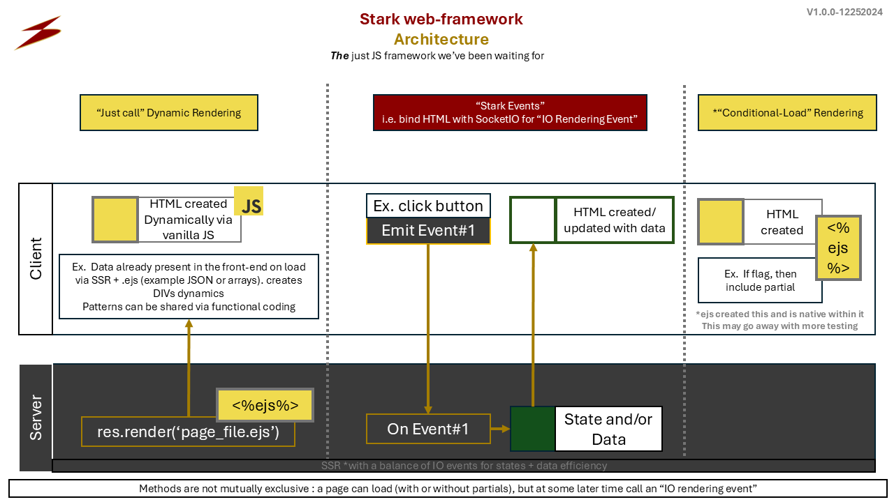

<br/>
<br/>
<br/>


<br/>
<br/>
<br/>

# Stark Framework

<br/>
<br/>
<br/>


# Current State :

It's obvious the current JS frameworks are :
- needlessly complex with the learn-to-benefit ratio lacking
- difficult to maintain, update, debug, and
- Scaling and adding, editing new features complexity


<br/>
The "you don't understand it" argument does not work because :

Devs, especially new ones, are spending less time on features and more on learning framework specific complexities (ex. custom languages which depart from JS and the simplicities of web-native capabilities).
The developer experience does not flow and something has to change.


Sources : 

<a href="https://www.youtube.com/watch?v=3DzZA5RNa8I">proof #1</a>

<a href="https://www.youtube.com/watch?v=rdKQczxKwe8">proof #2</a>

<a href="https://www.reddit.com/r/ExperiencedDevs/comments/1dh9rly/the_chaos_of_react_in_medium_to_large_web_apps/">proof #3</a>
proof a "paradigm shift" is needed


<br/>


# <p style = "color : gold"> Ultimate goal : </p>
    Create a shift in the way we think about how content is retrieved and 
    
    rendered in the web via simple event-driven design
<br/>



<br/>
<br/>
<br/>


<br/>
<br/>
<br/>


# <p style = "color : gold">  Why Stark Framework : </p>
- Even simplier than Vue :

    - Stark Framework is just vanilla JS, HTML, templating, CSS + IO events
    - focus less on frameworks and more on creating actual value for the company

- More freedom to write how you want to
    - easier styling
    - easier components
    - easier dynamic content
    - easier state data events (live data updates, GET data, POST data, state updates)

- Flexible structure to make coding enjoyable again: 
    - less of a framework and more of a paradigm shift :
    - vanilla JS, HTML, IO events, good folder structure, and re-usable partials are good enough
    
- you shouldn't have to learn a new language to be a front-end DEV and just to be able to render HTML
- state management, dynamic HTML, GET , POST data simplified via vanilla JS + client-to-server IO events


<br/>
<br/>
<br/>


# <p style = "color : rgb(0, 200, 200)">  FAQ : </p>

- <p style = "color : rgb(0, 200, 200)">  Do I have to know or use React, Vue, Svelte or any of legacy frameworks? </p>
    - No

- <p style = "color : rgb(0, 200, 200)"> What do I need to know? </p>

    - required : vanilla JS, HTML, CSS

    - required : socket IO events (very simple)

    - optional : express JS *

    - optional : DB skills *

    - optional : server skills *

        \* = see example project

<br/>

-  <p style = "color : rgb(0, 200, 200)"> What would be a good stack to use? </p>

    "MENT" : mySQL, expressJS , nodeJS, templating engine (.ejs) **
    
    \** = see example project + may go away (still testing)

<br/>


- <p style = "color : rgb(0, 200, 200)"> How is this different from just using express JS? </p>
    - HTML is dynamically updated and interacted with via SOCKET IO / IO events
    - Stark ("obvious") framework is a return to simple, common-sense web development

<br/>

-  <p style = "color : rgb(0, 200, 200)"> Why now? </p>

    - feels like the right timing

        - a framework which is just JS, HTML, css is <strong>needed now</strong>

    - server costs are going down every year, making SSR more attractive

    - live (and gamified) data interactions and retrieval mechanisms are going up every year


<br/>
<br/>
<br/>

# <p style = "color : gold"> Main Features List : </p>

    ✅ Standard "get" IO event package : 
        ✅ See example_express_project >>> "get_name" , & "get_table_data_1" ... & ""
    🔳 Get user detail from current user ID via socket IO event
    ✅ Simple socket IO + pagination (see function "get_user_names")

    🔳 Repository of re-usable components : 
        🔳 homepage logged out
        🔳 homepage logged in
        🔳 header navigation
        🔳 footer nagivation
        🔳 generic view data table


    🔳 Event types (draft stilling working this out) : 
        ✅ update         : updates the id within package
        🔳 clear          : clear data of the id within package
        🔳 append         : appends single-data-value to div id within "appendToDiv" of package
        ✅ append_list    : appends list of values to div id within "appendToDiv" of package
    

    ✅ Show divs on IO event :
        stark_show_divs(package_data)
        Example usage : see "example_express_project" >>> "views" >>> "home_logged_out.ejs"


    ✅ Hide divs on IO event
        stark_hide_divs(package_data)
        Example usage : see "example_express_project" >>> "views" >>> "home_logged_out.ejs"


    ✅ Standard "post" IO event package :
        ✅ Add a single data value with user id (retrieve via logged in cookie + JWT) into DB example :
            See example_express_project >>> "post_data_1" ...


    🔳 Search :
        🔳 Use Case #1 - search for value, add value, post value into user table
            🔳 get data call
            🔳 show results in HTML table
            🔳 onclick row - add value to DIV
            🔳 onclick save - add value to user table


    🔳 Errors : 
        🔳 Error object :
            🔳 error reason
            ✅ show error DIV on error : 
            🔳 custom styling for errors
            🔳 error notifications


<br/>
<br/>
<br/>

# <p style = "color : red"> Problems being solved : </p>
- Truely re-usable, non-breaking UI components with just HTML, CSS, JS + socketIO
    - Example : 
        if there's a GET event on one page, I can easily call that same event on a completely different page and it just works
- Efficient data loading via IO (socket IO) events : 
    - Load only what is needed when it is needed
- A structure which :
    - effectively fights entropy and
    - increases speed, feature velocity and developer happiness over time

<br/>
<br/>
<br/>


# <p style = "color : gold">  Framework Goals : </p>
- Reduce complexity of creating websites
- Increase feature releases, fixes and updates
- Provide an architectural structure which is obvious and easy for any level of developer

<br/>
<br/>
<br/>

# <p style = "color : green">  A example STACK in action and to make life easier : </p>

The example express project is part of "MENT" stack :
mySQL , express, nodeJS, templating engine (ejs)

*Note : testing is on-going to remove the need for a templating engine altogether and use "template events" (vanilla JS) only


<br/>
<p style="font-size: 1.17vw">*Note : testing still being performed on dynamic partial loading </p>

<br/>
<br/>
<br/>


<br/>
<br/>
<br/>

# <p style = "color : gold">  Stark Framework Pillars : </p>
- Load only what is needed when needed
- Keep it simple : only JS, HTML, CSS and socket IO events
- Do not mix HTML + JS directly together like all other frameworks do but allow HTML to be created dynamically to make development enjoyable and scalable
- Prioritize simple, event-driven dynamic rendering of needed UI components over other methods (example templating engine)
- If there is a strictly HTML, JS, socketIO events way to accomplish a task, then prioritize that
    - eg .ejs is doing with conditional loading and other features (while still allowing for data to be sent via requests), then let's try pursuing that
- snake_case for reduced context-shifting and mental strain
Why? see <a href="https://stackoverflow.com/questions/21503430/snake-case-or-camelcase-in-node-js
        https://www.cs.kent.edu/~jmaletic/papers/ICPC2010-CamelCaseUnderScoreClouds.pdf">here</a>
and <a href="https://stackoverflow.com/questions/33094418/why-use-camel-case-for-js-and-snake-case-for-your-db">here</a>

        This means everything is snake_case (yes even front-end)
        The DB syntax matches the back end which matches the front-end which matches the API
        But write however you want, my only goal is to help the current state of front-end and dev. because it is needed.

<br/>
<br/>
<br/>

# Getting Started  : 

<br/>

There are multiple ways to get the most out of this repo. Approach #0 is all about the philosophy of dynamic data retrieval and posting design patterns. All approaches forward are increasing applications of real-time simple data.


## <p style = "color : green">  Approach #0 - paradigm shift : </p>
    start using socket IO to interact with HTML + JS and truly dynamic and re-usable HTML components

    Optional : create IO components using this method


<br/>
<br/>
<br/>

## <p style = "color : green"> Approach #1 - running the full-stack example project :  </p>

<p style="font-size : 3vw; color : yellow;" > One Time Setup : </p>

1) open example express project and have at it , then : 

        npm install

        cd .\example_project_express\  

2) Then create a .env file within "example_express_project" root directory (same level as package.json)
    
    Place these into .env file : 

        db_name = "stark_framework_test"
        db_user_name = "root"
        db_host = "localhost"
        db_port = 3306
        db_pw = ""
        JWT_SECRET = ""

3) Install mySQL + mySQL workbench + mySQL server
    https://dev.mysql.com/downloads/mysql/

4) within .env : 
        
    1. replace db_pw with your mySQL password setup


5) Create + populate example DB : 
    
    Run "stark_framework_test_db.sql" within mySQL workbench via new SQL query :

    


6) Run the entire application (full-stack) :
        
        Open a new Terminal

        cd .\example_express_project\

        nodemon server.js

<br/>
<p style="font-size : 3vw; color : yellow;" > How to run application on-going (after one-time setup) : </p>

1. cd .\example_express_project\
1. nodemon .\server.js
1. Open : http://localhost:8080/

Successful start of the application text you should see within terminal :


<br/>
<br/>
<br/>


## <p style = "color : green"> Approach #2 - use the Stark framework structure (ex. steps): </p>
0) See example_express_project for folder structure and examples

1) copy stark_framework.js (located in example_express_project/public/js) into your project JS folder :
    Example : 

        public/js

    views folder : 

        file_name.ejs

2) Create route (using express structure views + routes):

    Example : 
    ``` js
    app.get("/", function(req, res){
        res.render("file_name.ejs")
    })
    ```

3) Place the JS script import into your html or templating file (ex. at the top of "file_name.ejs") : 
    
    Copy and Paste the JS file, located within  public/js/stark_framework.js, into your public folder. For Example : 

    ``` 
        public/js/stark_framework.js

    ```

    then within your view/HTML file place the following script :

    ```js
        <script src="js/stark_framework.js"></script>
    ```
4) Create and call events in your HTML or templating file via vanilla JS : 
    
    Example : 
    ``` js
    function button_clicked(){
        var emit_package = "test";
        socket.emit('get_data_event', emit_package)
    };
    
    ```
5) Create the same event server-side (including option response depending on direction of data you need) : 

    Example :
    ``` js
        socket.on('get_data_event', function(data){

            var user_data = ["1"];
            var socket_package = {
                "id"                : "user_data", 
                "name"              : "user_data",
                "className"         : "user_data",
                "appendToDiv"       : "container_user_data",
                "data"              : user_data,
                "error"             : "",
            };

            socket.emit("got_data_event", socket_package);
        })
6) Handle retrieved data on the front-end by placing the following into your .ejs (templating file) or JS folder. NOTE : The following is all front-end code and some parsing may be needed depending on the data structure you go with (ex. JSON structure works best) : 

    ```js
    socket.on("got_data_event", function(data){

        // Option #1 : vanilla JS
        document.getElementById("single_user_data").innerText = data[0];

        // Option #2 : use stark framework with simple dynamic code updates :
        update_stark_value(package_data);

    })
    ```

## <p style = "color : green"> Approach #3 - take and give : </p>

1) Go into "example_express_project" and take what you need

2) Create standalone IO events + HTML components :
3) Share those components within "common_components" folder (top level folder)
    
    make sure to also include the server event example please

Example : 
1) create a socket emit event on the front-end :

```js
    socket.emit("get_data", ...
```

2) create a socket ON (GET data event) on the back-end :

```js
    socket.on("get_data", ...
```

3) tie the socket ON event to db utils or other data from the server : 

```js
    socket.on("get_data", ...

    // Simple Example (or use db utils): 
    var user_data = "test 1";

    // OR DB Example : 
    var user_data = db_utils.get_user_data()

    ...


```

4) create a socket EMIT event to the back-end :

```js

    var socket_package = {
        ...
        "data" : user_data
        ...
    }

    socket.emit("got_data", socket_package)
```

5) Handle socket GOT data event on the front-end : 

```js
    socket.on("got_data", function(data){
        // Handle IO event via vanilla JS
    })
```

<br/>
<br/>
<br/>


## <p style = "color : green"> Approach #4 -Create standalone components + IO event : </p>
    1) Create .ejs file within partials folder
    2) create socket EMIT and ON events
    3) show how event gets data (example ON event on the server)

<br/>
<br/>
<br/>


### <p style = "color : yellow">  Different ways to dynamically render HTML components :

1) Rendered all at once (via ejs include) or 

2) Rendered conditionally :
    see home_logged_out.ejs

    Example using .ejs : 
        <% if ( render_component_2 == 1 ){ %>
            <%- include('./partials/component_2.ejs') %>
        <% } %>
3) Rendered efficiently and dynamically via socket IO events through JS functions or user events


<br/>
<br/>
<br/>


### Optional Steps : 
- If you are using the example project, then change VS Code settings to not show .ejs errors :

        preferences --> settings --> uncheck "HTML › Validate: Scripts"

<br/>
<br/>
<br/>

### <p style="color: orange"> Errors and Solutions : </p>

<p style = "color : red"> Error : DB setup ERROR, error = Error: ER_NOT_SUPPORTED_AUTH_MODE: Client does not support authentication protocol requested by server; consider upgrading MySQL client

   <p style = "color : green "> Solution :

1. open mySQL workbench
1. new Script
1. paste :
    ALTER USER 'root'@'localhost' IDENTIFIED WITH mysql_native_password BY 'your_password'; FLUSH PRIVILEGES;
1. replace your_password with yours
1. mySQL workbench green text OK
1. return to code repo
1. save server.js or any file if you ran nodemon
        if not, start server via nodemon server.js
1. Message should state "DB setup OK" in green text
1. Good Job

    SQL debug/solution : 
    <a href = "https://stackoverflow.com/questions/7534056/mysql-root-password-change"> here </a>
   </p>

</p>

<br/>
<br/>
<br/>

<p style = "color : red"> Error       : ReferenceError : io is not defined
    
<p style = "color : green "> Solution :
    
    Make sure io connection is AFTER server.listen
</p>

   

<br/>
<br/>
<br/>


<p style = "color : red"> Error : "js/stark_framework.js” was blocked due to MIME type (“text/html”)"
    

<p style = "color : green "> Solution :

make sure your express app is using the correct location where your static content is housed.
    
For example : 

    express.static("public/")

    would be a structure of : 
        public
        routes
        views
        server.js

</p>

<br/>
<br/>
<br/>

Author :

    Stark


<br/>
<br/>
<br/>
<br/>
<br/>
<br/>
<br/>

Sources :

Express framework - example from https://expressjs.com/en/starter/hello-world.html